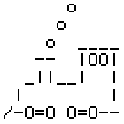

  

## REPOSITORY

- <https://github.com/tecolicom/sl>

## LINKS

- <https://en.wikipedia.org/wiki/SL>
- <https://ja.wikipedia.org/wiki/Sl_(UNIX)>
- <https://github.com/ghaerr/elks/blob/master/elkscmd/tui/sl.c>
- <https://x.com/toyodam/status/1718167634196472065/>
- <https://x.com/n_soda/status/1207639714347438081>
- <https://atmarkit.itmedia.co.jp/news/200909/07/lltv01.html>
- <https://utashiro.hatenablog.com/entry/20070407/1175911268>
- <https://utashiro.hatenablog.com/entry/20101103/1288758988>
- <https://utashiro.hatenablog.com/entry/20110522/1306035761>
- <https://gist.github.com/kaz-utashiro/f36da47151a4a583961bed7847122c96>
- <https://creazy.net/2008/02/sl_js.html>
- <https://creazy.net/2008/02/sl_js_toyodamasashi_in_twitter.html>
- <https://www.tkl.iis.u-tokyo.ac.jp/~toyoda/sl/links.html>

## JUNET生誕40周年記念シンポジウム

### 開催
 - 2024年11月25日 15:00～19:30
 - 東京大学山上会館
 - <https://internetweek.jp/2024/archives/program/j2>
 - <https://sites.google.com/keio.jp/junet40>
   - 内容は「UNIXとJUNET」と書いてあるけど、そんなことは事前に一言聞いてなかったので sl について話した。こんなページがあったことも知らなかった。だいたい、こんな漠然としたテーマで話せるわけないので、知らなくてよかったw

### スライド
  - [PDF](https://tecolicom.github.io/sl/junet40th/junet40th.pdf)
  - [HTML](https://tecolicom.github.io/sl/junet40th/junet40th.html)
