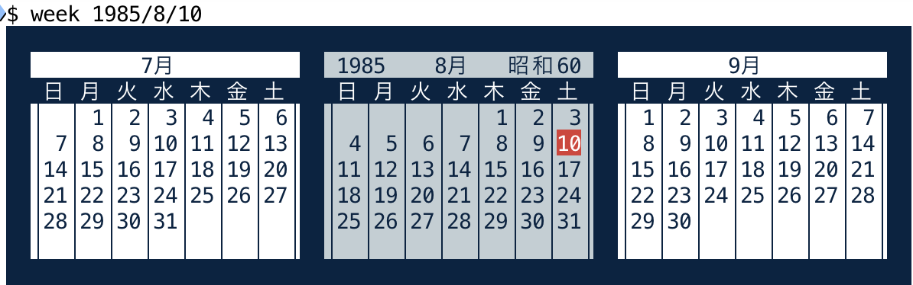

# sl


--utashiro

---
# こんなのが走る
```
char *ban[] = {
    "      o     ",
    "     o      ",
    "    o  ____ ",
    "   --  |OO| ",
    "  _||__|  | ",
    " |        | ",
    "/-O=O O=O-- "
};
```

---
# sl
 

---
# fj.sources or fj.jokes?
- 1985年
- fj.sources だっけ? fj.jokes かも?
- 環境
  - VAX-11/780 + 4.2BSD? (ASCII版?)
  - VT-100 or PC-9801
  - 9600bps RS232-C 接続

---
# 開発ソースを発見


`sl.org.c` と `sl.c` という2つのファイルがある。

---
# 1985-08-10 は...



- 土曜日だった
- 仕事でもないのに休日出勤して作ってたらしい
- しかも終電ギリギリ

---
# sl.org.c - curses library を使っている
```
    for (i=0; i <= width; i++) {
            for (j=0; j < 7; j++) {
                    move(j + ceil, 0);
                    delch();
                    move(j + ceil, NCOLS-2);
                    addch(*(ban[j]+i));
            }
            refresh();
    }
    for (i=NCOLS; i ; i--) {
            for (j=0; j < 7; j++) {
                    move(j + ceil, 0);
                    delch();
            }
            refresh();
    }
```

---
# sl.c - リリース版は fputs() に変更
```
    for (i=NCOLS; i ; i--) {
        for (j=0; j < 7; j++) {
            fputs (tgoto (CM, i, j + ceil), stdout);
            putns (ban[j], NCOLS - i);
        }
        refresh();
    }
    for (i=0; i <= width ; i++) {
        for (j=0; j < 7; j++) {
            fputs (tgoto (CM, 0, j + ceil), stdout);
            putns (ban[j] + i, 100);
        }
        refresh();
    }
```

---
# SIG_IGN 問題

- 開発ソースでは `^C` で穏やかに終了するようになっている
- fj に投稿する直前に無視するコードを入れたのかも
- でも `/* コメントアウト */` してた

---
# sl その後

---
# 2010年版

---
# 2010年版
グラフィックを変更
```
char *sl[] = {
    "      o o o",
    "     o  ",
    "    o  ____  ",
    "   --  |OO|  ",
    "  _||__|  |  ",
    " |        |  ",
    "/-O=O O=O--  "
};
```

---
# 煙が残る


---
# 2010年版の欠陥
走り終わっても画面を消さないために、終了処理をサボっている。
```
int main()
{
        int x, y;
        initscr();
        for (x = COLS - 13; x > 0; x -= 2) {
                for (y = 0; y < 7; y++)
                        mvprintw(y + LINES - 7, x, "%s", sl[y]);
                refresh();
                usleep(100000);
        }
        /* endwin(); */
}
```
そのため、実行後に端末をリセットしないと使えない。

---
# 2011年 jslinux 版
jslinux で sl 動かないと twitter でカラまれたので移植した


---
# 2023年版

---
# 2023年版


---
# 2023年版
罫線素片を使用してディテールを再現
```
char *sl[] = {
    "      o o o o",
    "     o       ",
    "    o  ┯━━┯  ",
    "   ╒╕  │OO│  ",
    " ┌─┘└──┘  │  ",
    "┌┘        │  ",
    "┴─O=O O=O─┴ з\n"
};
```

---
# one more thing

---
# ラッセル機能搭載


---
# sl-2023.c
2023年版では AI の助けを借りて端末リセット問題を解消
```
char *sl[] = {
    "      o o o o",
    "     o       ",
    "    o  ┯━━┯  ",
    "   ╒╕  │OO│  ",
    " ┌─┘└──┘  │  ",
    "┌┘        │  ",
    "┴─O=O O=O─┴ з\n"
};
int main() {
    setupterm(NULL, STDOUT_FILENO, NULL);
    int COLS = tigetnum("cols"), LINES = tigetnum("lines");
    int len = strlen(sl[0]), height = sizeof(sl)/sizeof(sl[0]);
    int start_x = COLS - len, start_y = LINES - height - 1;
    char dch2[20] = "", *dch2p = tparm(tigetstr("dch"), 2);
    if (dch2p != NULL)
        strcpy(dch2, dch2p);
    char smoke[1024]; strcpy(smoke, sl[0]); sl[0] = smoke;
    for (int x = start_x/2*2; x >= 0; x -= 2) {
        for (int y = 0; y < height; y++) {
            mvprintw(start_y + y, 0, "%s", dch2);
            mvprintw(start_y + y, x, "%s", sl[y]);
        }
        fflush(stdout);
        strcat(smoke, " o");
        usleep(100000);
    }
}
```

---
# Wikipedia


---
# 豊田版 sl
端末エミュレーター前提なので遅延は問題にならない
 

---
# mac 版


---
# jslinux 版


---
# javascript 版


---
# vimperator 版 for Firefox


https://atmarkit.itmedia.co.jp/news/200909/07/sl01.png

---
# https://github.com/kaz-utashiro/sl
submodule 化したw


---
# 1997年に吐いてた暴言

    役に立たないものも作れなくて、役に立つものが作れるものか。


